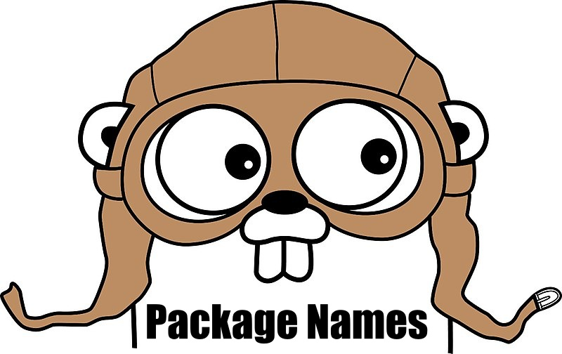

원문 - [The Go Blog - Package Names](https://blog.golang.org/package-names) (Sameer Ajmani - 4 February 2015)

(원문은 Creative Commons Attribution 3.0 License 로 배포 되므로 원작자의 동의 없이 번역 및 배포 합니다.)



# 개요

Go 코드는 패키지로 구성된다.
패키지 내부에서는 정의된 어떤 식별자(이름)도 참조할 수 있지만 패키지의 클라이언트는 노출된 타입, 함수, 상수 그리고 변수만 참조할 수 있다.
이런 참조는 항상 `foo.Bar` 와 같은 프리픽스를 포함한다.
`foo.Bar`는 임포트한 `foo` 패키지에서 노출된 이름 `Bar`을 참조한다.

좋은 패키지 이름은 코드를 더 좋게 만든다.
좋은 패키지 이름은 패키지 내용에 대한 컨텍스트를 제공하고, 패키지 사용자가 패키지가 무엇을 위한 것이고 어떻게 사용하는지를 이해하기 쉽게 한다.
또한 좋은 패키지 이름은 패키지 매인테이너들이 패키지에 그것과 관련된 어떤 것을 포함하고 포함하지 않을지 결정하는 것을 돕는다.

잘 지어진 패키지 이름은 필요한 코드를 쉽게 찾을 수 있도록 만든다.

이펙티브 Go 문서는 패키지, 타입, 함수, 변수 네이밍에 대한 [가이드라인](https://golang.org/doc/effective_go.html#names)을 제공한다.
이 블로그는 그 토론을 확장하고 표준 라이브러리에서 찾아낸 이름들 확인해 본다.
또한 나쁜 이름에 대해 살펴보고 어떻게 고칠지에 대해서도 토론한다.

# 패키지 이름

좋은 패키지 이름은 짧고 간결하다.
`언더바(under_scores)`나 `대소문자 섞어쓰기(mixedCaps)`가 없이 소문자로 이뤄진다.
좋은 패키지 이름은 간단한 명사로 이뤄진다. 다음 처럼 말이다:

-   `time` (시간 측정 및 출력 기능 제공)
-   `list` (이중 링크드 리스트 구현)
-   `http` (HTTP 서버 및 클라이언트 구현 제공)

다른 언어의 일반적인 이름 스타일은 Go 프로그램에서는 관용적이지 않을 수 있다.
여기 다른 언어에서는 좋은 스타일의 이름일지도 모르지만 Go에서는 그렇지 않은 이름 예시가 2가지가 있다:

-   `computeServiceClient`
-   `priority_queue`

Go 패키지는 타입과 함수를 노출한다.
예를 들면, `compute` 패키지는 여러 클라이언트들 중에 계산(compute) 기능만 분할하여 서비스를 이용할 수 있는 메소드들을 노출한 `Client` 타입을 노출할 수 있다.

**약자는 신중하게 사용한다.** 약자가 프로그래머들에에 익숙하다면 패키지 이름을 약자로 만들 수도 있다.
널리 사용되는 패키지에는 종종 축약된 이름이 있다:

-   `strconv` (string conversion)
-   `syscall` (system call)
-   `fmt` (formatted I/O)

반면에, 모호하거나 명확하지 않다면 패키지 이름을 축약하지 마라.

**사용자에게서 좋은 이름을 빼앗지 마라.** 클라이언트 코드에서 일반적으로 사용되는 이름들은 패키지 이름으로 피해야 한다.
예를 들면, buf는 버퍼에 대한 좋은 변수명이기 때문에 buffered I/O 패키지는 `buf`아 아니라 `bufio`로 불린다.

# 패키지 컨텐츠 이름

클라이언트 코드는 패키지의 이름과 패키지 컨텐츠의 이름을 함께 사용하기 때문에 그 둘은 연결되어 있다(coupled).
패키지를 설계할 때는 클라이언트 쪽 관점을 가져라.

**말더듬기(반복)를 피해라.** 클라이언트 코드는 패키지 이름을 패키지 컨텐츠를 참조하는데 프리픽스로 사용하므로 패키지 컨텐츠의 이름은 패키지의 이름을 반복할 필요가 없다.
`http` 패키지에서 제공하는 HTTP 서버는 `HTTPServer`가 아니라 `Server`라고 불린다.
클라이언트 코드는 `http.Server` 라고 이 타입을 참고할 것이기 때문에 모호하지 않다.

**함수 이름을 단순화 해라.** 함수가 `pkg.Pkg` (또는 `*pkg.Pkg` ) 타입의 값을 리턴한다면, 혼동 없이 함수 이름에서 타입 이름을 생략할 수 있다:

```go
start := time.Now()                                  // start is a time.Time
t, err := time.Parse(time.Kitchen, "6:06PM")         // t is a time.Time
ctx = context.WithTimeout(ctx, 10*time.Millisecond)  // ctx is a context.Context
ip, ok := userip.FromContext(ctx)                    // ip is a net.IP
```

`pkg` 패키지의 `New`라는 이름의 함수는 `pkg.Pkg` 타입의 값을 리턴한다.
이는 그 타입을 클라이언트 코드에서 사용하기 위한 표준 엔트리 포인트이다:

```go
q := list.New()  // q is a *list.List
```

어떤 함수가 `pkg.T` 타입의 값을 리턴하고 `T`가 `Pkg`가 아니라면, 클라이언트 코드가 이해하기 쉽도록 함수 이름에 `T`를 포함할 수도 있다.
여러 New 같은 함수를 가진 패키지의 일반적인 상황은 다음과 같다:

```go
d, err := time.ParseDuration("10s")  // d is a time.Duration
elapsed := time.Since(start)         // elapsed is a time.Duration
ticker := time.NewTicker(d)          // ticker is a *time.Ticker
timer := time.NewTimer(d)            // timer is a *time.Timer
```

서로 다른 패키지들에서 타입 이름들이 동일할 수 있다. 왜냐하면 클라이언트 코드 관점에서 그런 이름들은 패키지 이름으로 구별되기 때문이다.
예를 들면, 표준 라이브러리는 `jpeg.Reader`, `bufio.Reader` 그리고 `csv.Reader` 를 포함해 `Reader` 라는 이름의 타입을 여러 개 가지고 있다.
각 패키지 이름은 `Reader`와 만나 좋은 타입 이름을 만든다.

패키지 이름이 패키지 컨텐츠를 위해 이런 의미의 프리픽스라고 생각할 수 없다면, 패키지 추상화 경계가 잘못된 것이다.
클라이언트가 사용하는 것처럼 코드를 작성하고, 결과가 나쁘다면 패키지를 재구성하라.
이 접근법이 클라이언트들이 이해하기 쉽고 패키지 개발자들이 유지보수하기 쉬운 패키지를 만들어 낼 것이다.

# 패키지 경로

Go 패키지는 이름과 경로를 모두 가지고 있다.
패키지 이름은 소스 파일의 package 문(statement)에 의해서 기술된다. 클라이언트 코드는 이를 패키지의 노출된 이름을 위한 프리픽스로 사용한다.
클라이언트 코드는 패키지를 임포트할 때 패키지 경로를 사용한다.
관례적으로, 패키지 경로의 마지막 요소가 패키지 이름이다:

```go
import (
    "context"                // package context
    "fmt"                    // package fmt
    "golang.org/x/time/rate" // package rate
    "os/exec"                // package exec
)
```

빌드 도구는 패키지 경로를 디렉토리에 맵핑한다.
Go 도구(go tool)는 `$GOPATH/src/github.com/user/hello` 디렉토리 내에서 `"github.com/user/hello"` 경로의 소스 파일을 찾기 위해 [GOPATH](https://golang.org/doc/code.html#GOPATH)환경 변수를 이용한다.
(물론 이 상황은 친숙하지만, 용어와 패키지의 구조를 명확히 하는 것이 중요하다.)

**디렉토리들** 표준 라이브러리는 관련 프로토콜과 알고리즘 패키지를 그룹화 하기 위해 `crypto`, `container`, `encoding`, 그리고 `image` 같은 디렉토리를 사용한다.
이 디렉토리들과 패키지들 사이에는 실제적인 관계는 없다; 디렉토리는 단지 파일들을 정렬하는 방법만 제공한다.
모든 패키지는 순환 임포트를 만들지 않는 한 다른 어떤 패키지든 임포트할 수 있다.

다른 패키지의 타입이 모호하지 않은 동일한 이름을 가질 수 있는 것 처럼, 다른 디렉토리 내의 패키지도 동일한 이름을 가질 수 있다.
예를 들면, [runtime/pprof](https://golang.org/pkg/runtime/pprof) 은 [pprof](https://github.com/google/pprof) 프로파일 툴을 제공하고, [net/http/pprof](https://golang.org/pkg/net/http/pprof)는 HTTP 포맷의 프로파일 데이터를 보여주는 HTTP 엔드포인트를 제공한다.
클라이언트 코드는 패키지를 임포트 하기 위해 패키지 경로를 사용하기 때문에 혼란이 없다.
소스 파일이 두 가지 `pprof` 패키지를 임포트해야 하면, 패키지 하나 또는 둘다 리네임[rename](https://golang.org/ref/spec#Import_declarations) 할 수 있다.
임포트된 패키지를 리네임할 때, 변경될 로컬 이름도 패키지 이름과 동일한 가이드라인을 따라야 한다(소문자 사용, `언터바(under_scores)` 금지, `대소문자 혼용(mixedCaps)` 금지 ).

# 나쁜 패키지 이름들

나쁜 패키지 이름은 코드 탐색과 유지를 어렵게 한다.
여기 나쁜 이름을 인지하고 수정하는 몇 가지 가이드라인이 있다.

**무의미한 패키지 이름을 피하라.** `util`, `common`, 또는 `misc` 등의 패키지 이름은 클라이언트에게 패키지 컨텐츠에 대한 정보를 제공하지 못한다.
이는 패키지 사용을 힘들게 하고 매인테이너들이 패키지에 집중력을 유지하기 힘들게 한다.
이런 패키지에는 시간이 지남에 따라, 불필요한 이름은 특히 커다란 프로그램에서 불필요하고 현저히 컴파일을 느리게 만드는 종속성들이 누적된다.
이런 패키지 이름들은 일반적이기 때문에, 임포트한 클라이언트 코드의 다른 패키지와 충돌할 가능성이 높고 다른 것들과 구별하기 위해 이름을 다시 만들게 강요하게 된다.

**일반적인 패키지를 분리하라.** 이런 패키지를 수정하려면, 공통 이름을 가진 타입과 함수를 찾아 별도의 패키지로 만들라.
예를 들면, 이런 패키지가 있다면

```go
package util
func NewStringSet(...string) map[string]bool {...}
func SortStringSet(map[string]bool) []string {...}
```

클라이언트 코드는 다음과 같고

```go
set := util.NewStringSet("c", "a", "b")
fmt.Println(util.SortStringSet(set))
```

컨텐츠에 적당한 이름을 선택해 이 함수들을 `util`에서 분리해 새 패키지로 넣는다:

```go
package stringset
func New(...string) map[string]bool {...}
func Sort(map[string]bool) []string {...}
```

그러면 클라이언트 코드는 다음과 같이 되고

```go
set := stringset.New("c", "a", "b")
fmt.Println(stringset.Sort(set))
```

변경한 후에는 새 패키지를 개선하는 방법을 쉽게 알수 있다:

```go
package stringset
type Set map[string]bool
func New(...string) Set {...}
func (s Set) Sort() []string {...}
```

클라이언트 코드도 더 간단해진다:

```go
set := stringset.New("c", "a", "b")
fmt.Println(set.Sort())
```

패지키 이름은 디자인의 중요한 한 부분이다.
여러분의 프로젝트에서 의미 없는 패키지 이름을 제거하라.

**모든 API를 위한 단독 패키지를 사용하지 마라** 많은 프로그래머들이 코드 베이스의 진입점을 찾기 쉽게 만들거라 생각하고 좋은 의도로 모든 프로그램의 노출 인터페이스를 `api`, `types`, `interfaces`와 같은 이름의 단독 패키지에 둔다.
이는 실수이다.
이런 패키지도`util`나 `common` 이름의 패키지와 마단가지로 제한 없이 커지고, 사용자들에게 사용 지침이나 정교한 종속성을 제공하지 않고, 다른 임포트 패키지와 충돌하는 등의 문제를 유발한다.
구현으로부터 공개 패키지를 분리하기 위해 디렉토리를 사용하는 등으로 패키지를 분리하라.

**불필요한 패키지 이름 충돌을 피하라** 다른 디렉토리에 패키지는 동일한 이름을 가질 수 있지만, 자주 함께 사용되는 패키지들은 고유한 이름을 가져야 한다.
자주 함께 사용되는 패키지들이 이름이 같으면 혼동을 야기하고 클라이언트 코드에 로컬 리네임을 필요하게 만든다.
동일한 이유로 `io`나 `http` 같은 유명한 표준 패키지의 이름을 사용하는 것을 피해라.

# 결론

패키지 이름은 Go 프로그램에서 좋은 이름을 위한 중심이다.
좋은 패키지 이름을 선택하기 위해 시간을 투자해서 코드를 잘 조직화 해야 한다.
이는 사용자가 패키지를 이해하고 사용하는데 도움이 되고 메인테이너들이 패키지를 우아하게 성장시키는데 도움이 된다.

# 더 읽을거리

-   [Effective Go](https://golang.org/doc/effective_go.html)
-   [How to Write Go Code](https://golang.org/doc/code.html)
-   [Organizing Go Code (2012 blog post)](https://blog.golang.org/organizing-go-code)
-   [Organizing Go Code (2014 Google I/O talk)](https://talks.golang.org/2014/organizeio.slide)
-   [Golang 에서의 명명 규칙](https://blog.billo.io/devposts/golang_naming_convention/)
